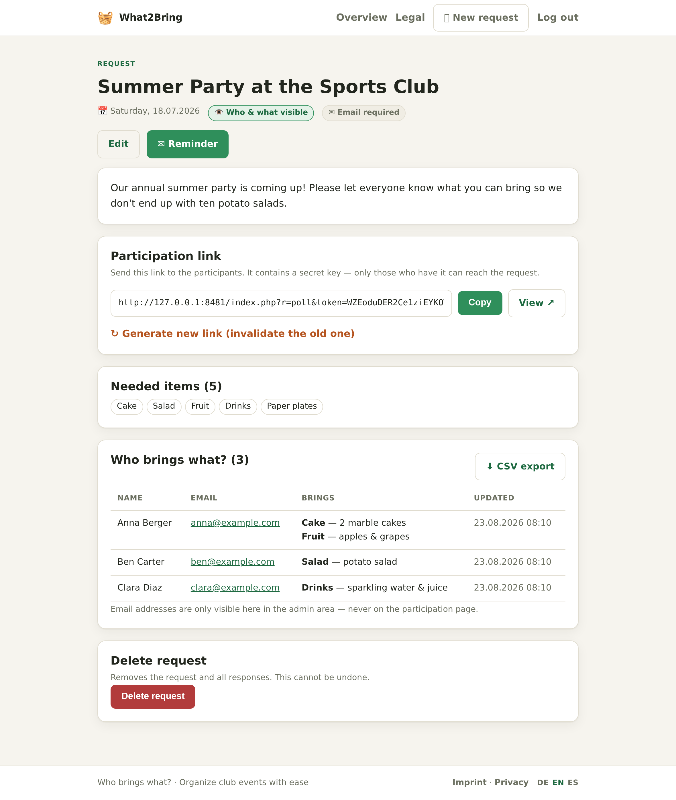
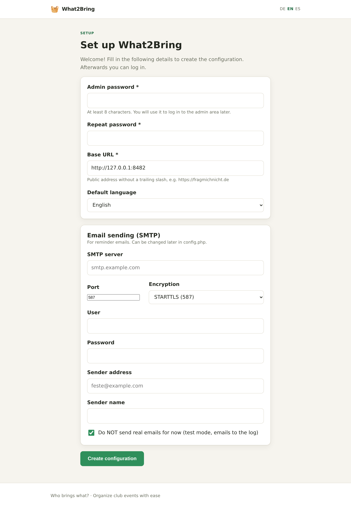
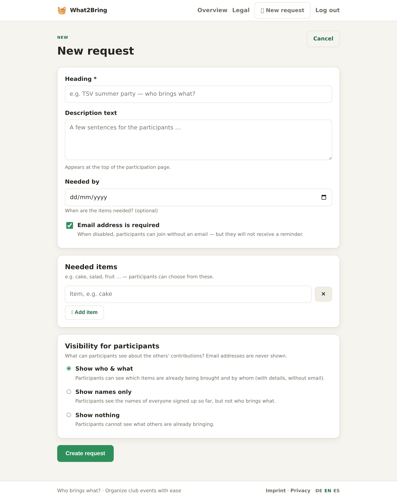
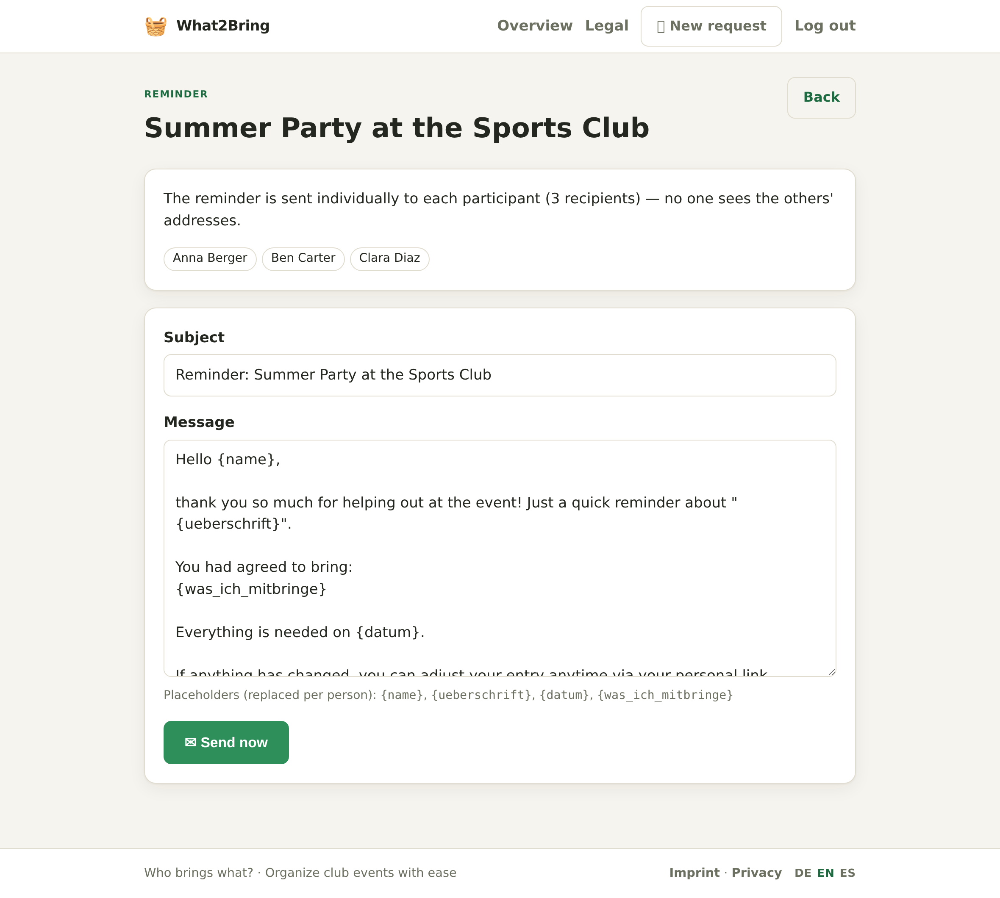
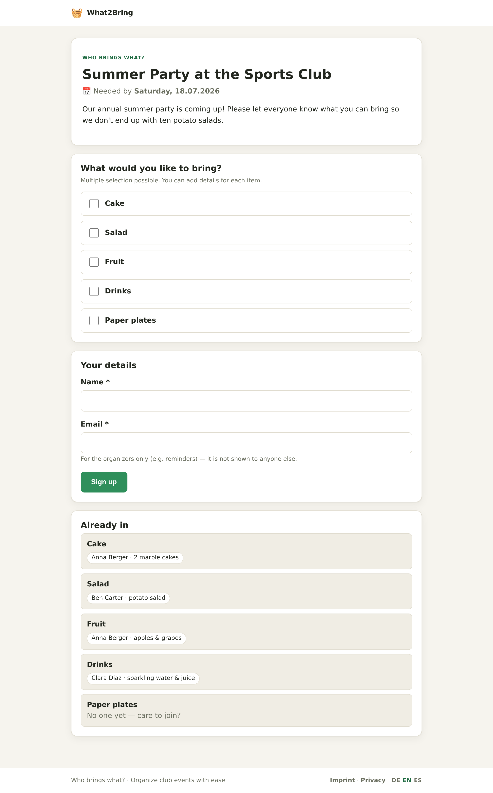
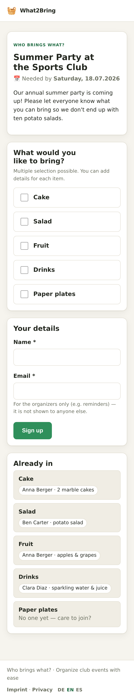
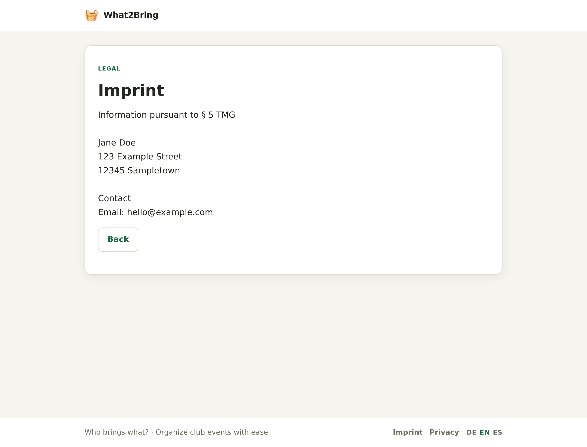

# 🧺 What2Bring

**“Who brings what?”** — a small, self‑hosted web app for organising club parties, potlucks and team events.
An organiser creates a *request* listing the things that are needed (cake, salad, drinks …) and shares **one secret
link**. People open the link, tick what they’ll bring, add a detail, and leave their name. No accounts, no app.

**PHP 8 + SQLite · no Composer · no build step · runs on cheap shared hosting.**
Available in **🇩🇪 German · 🇬🇧 English · 🇪🇸 Spanish**.



## Features
- **Requests** with a heading, description, “needed by” date and a dynamic list of items.
- **Secret share link** per request (rotatable — the old link stops working) so search engines stay out (`noindex`).
- **Participant page, no login:** multi‑select items, a detail per item, name + email. Re‑submitting with the same
  email updates the previous entry instead of duplicating it.
- **Per‑request email toggle** — make the email address required or optional.
- **Visibility per request:** show *who & what* · *names only* · *nothing* — **email addresses are never shown publicly.**
- **Reminder emails** with placeholders, sent **individually** (one recipient per message, no CC/BCC).
- **CSV export** of all responses (Excel‑friendly).
- **Imprint & privacy policy** editable in the admin area (stored in the DB, with templates to fill in).
- **Web installer** — first visit writes `config.php` for you.
- **Privacy‑first:** email plaintext lives in a separate table the public code path never reads; CSRF on every form;
  prepared statements; output escaping.

## Screenshots
| Setup wizard | New request | Reminder |
|---|---|---|
|  |  |  |

| Participant page | On mobile | Imprint |
|---|---|---|
|  |  |  |

## Quick start
1. **Requirements:** PHP 8.0+ with `pdo_sqlite`. That’s it.
2. **Upload the code** and point your domain’s document root at the **`public/`** folder (everything sensitive then
   sits above the web root). If you can’t move the docroot, the bundled top‑level `.htaccess` blocks direct access
   to `inc/`, `data/`, `templates/`, `config.php` and `schema.sql` instead.
3. **Open the site in your browser.** On the first visit the **setup wizard** appears — set an admin password, the
   base URL, the default language and (optionally) SMTP, then click *Create configuration*. The installer writes
   `config.php` and locks itself.
4. **Make `data/` writable** — the SQLite database is created automatically on first use.

> **Manual config instead of the wizard:** copy `config.php.example` to `config.php` (one level **above** `public/`)
> and fill it in. `mail_dry_run: true` keeps you in a safe test mode (reminders go to `data/mail.log`).

### Try it locally
```bash
cp config.php.example config.php      # or just open the site and use the installer
php -S 127.0.0.1:8080 -t public
# → http://127.0.0.1:8080/
```

### Docker (test container)
```bash
docker compose up -d --build          # php:apache, docroot public/, port 8470
```
Mounts `./data` (SQLite + mail log) and `./config.php`.

## 📖 Documentation
A full, illustrated handbook is included:

- **[English handbook](docs/HANDBOOK.md)**
- **[Handbuch (Deutsch)](docs/HANDBUCH.md)**

It walks through installation, creating and sharing requests, reminders, the legal pages, languages, security and
deployment — with screenshots.

## Security & privacy
- Emails **never** appear on public pages (structurally separated in the data model).
- Secret links use ≥128‑bit random tokens, are `noindex`, and can be rotated.
- CSRF tokens on every form; prepared statements throughout; all output HTML‑escaped.
- Admin login stores only a password hash and throttles repeated failures.
- The legal‑text templates are a **starting draft, not legal advice** — review before going live.

## License
MIT — see [LICENSE](LICENSE).
