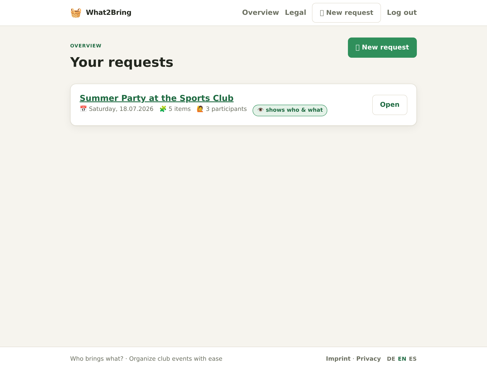
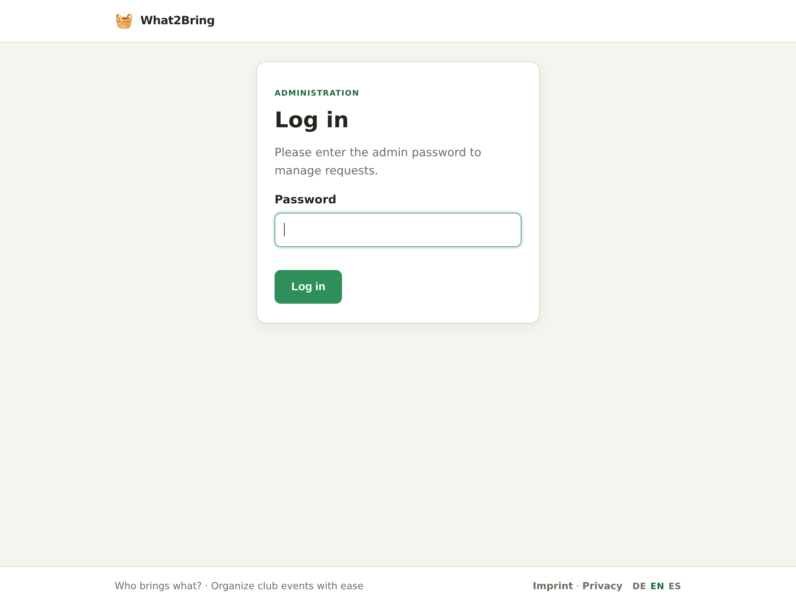
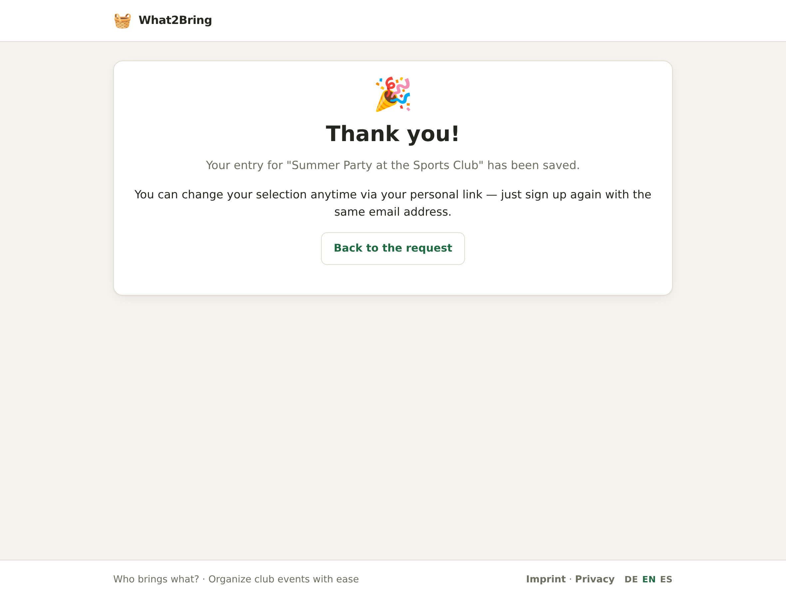
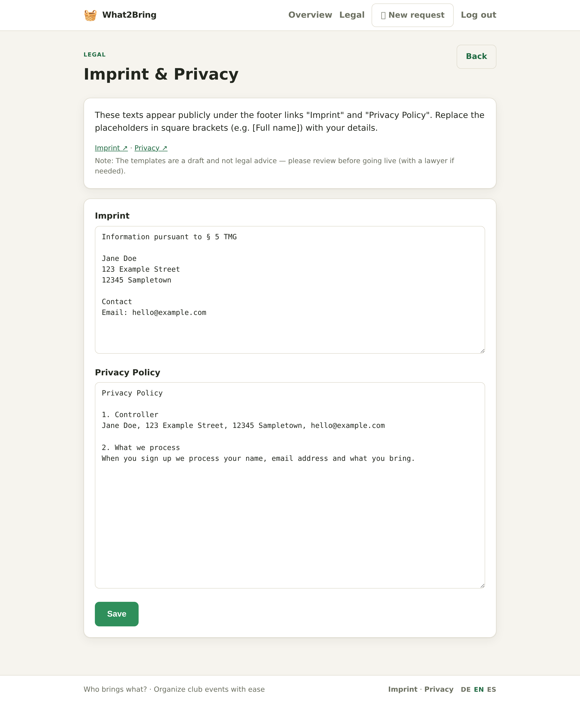

# What2Bring — Handbook

**What2Bring** is a small, self‑hosted web app for the classic club‑party question: **“Who brings what?”**
An organiser (admin) creates a *request* listing the things that are needed — cake, salad, fruit, drinks —
and shares one **secret link**. Participants open that link, tick what they will bring, add a detail or two,
and leave their name (email optional per request). No accounts, no app, works on cheap shared hosting.

> 🌐 Available in **German, English and Spanish** · 🔒 privacy‑first (emails never shown publicly) · 🧩 no build step, no Composer

- **Languages:** switch any time via the footer (DE · EN · ES); set the default during setup.
- **Screens in this handbook show the English UI.** The other languages look identical with translated text.

| | |
|---|---|
|  |  |

## Contents
1. [Requirements](#1-requirements)
2. [Installation](#2-installation)
3. [First login](#3-first-login)
4. [The dashboard](#4-the-dashboard)
5. [Creating a request](#5-creating-a-request)
6. [Managing a request & sharing the link](#6-managing-a-request--sharing-the-link)
7. [Sending reminders](#7-sending-reminders)
8. [The participant page](#8-the-participant-page)
9. [Imprint & privacy policy](#9-imprint--privacy-policy)
10. [Languages](#10-languages)
11. [Security & privacy](#11-security--privacy)
12. [Deploying to shared hosting (e.g. Strato)](#12-deploying-to-shared-hosting-eg-strato)
13. [Backup](#13-backup)
14. [Troubleshooting](#14-troubleshooting)

---

## 1. Requirements
- **PHP 8.0+** with the **`pdo_sqlite`** extension (bundled with the standard PHP Docker image and enabled on most shared hosts).
- The ability to serve a folder over HTTP. Ideally you can point the domain’s document root at the app’s **`public/`** folder; if not, a fallback `.htaccess` is included.
- **No** database server, **no** Composer, **no** build step. Email sending uses a tiny built‑in SMTP client.

## 2. Installation

1. **Get the code** — download a release archive or clone the repository, and upload it to your host.
2. **Document root** — point your domain at the **`public/`** directory. Everything sensitive (`config.php`, the
   database, `inc/`, `templates/`) then lives *above* the web root. If you cannot move the document root, the
   bundled top‑level `.htaccess` blocks direct access to those paths instead.
3. **Open the site in your browser.** On the very first visit — while `config.php` does not exist yet — What2Bring
   shows a **setup wizard**:

   

   Fill in:
   - **Admin password** (min. 8 characters) — you’ll use it to log in.
   - **Base URL** — the public address without a trailing slash, e.g. `https://example.com`. Used to build the
     shareable links.
   - **Default language** — DE / EN / ES.
   - **SMTP** (optional now, changeable later) — server, port + encryption (STARTTLS/587 or SSL/465), user,
     password, sender address and name.
   - **“Do NOT send real emails for now”** — leave ticked to start in a safe *dry‑run* (reminders go to a log file
     instead of being sent). Untick once your SMTP details are correct.

   Clicking **Create configuration** writes `config.php` (with a freshly generated password hash and secret
   *pepper*) and the installer **locks itself** — it never runs again while `config.php` exists.

> **Manual alternative:** copy `config.php.example` to `config.php` (one level above `public/`) and fill it in by
> hand. Generate the password hash with `php -r "echo password_hash('YOUR-PW', PASSWORD_DEFAULT);"` and the pepper
> with `php -r "echo bin2hex(random_bytes(32));"`.

## 3. First login
Go to `…/index.php?r=admin.login` and enter your admin password.

## 4. The dashboard
After logging in you land on **Overview** — the list of all your requests with their date, item count, number of
participants and a visibility badge. Use **＋ New request** to create one.

## 5. Creating a request

- **Heading** — the title participants see (e.g. *“Summer Party at the Sports Club”*).
- **Description** — a few friendly sentences (optional).
- **Needed by** — the date the things are needed (optional).
- **Email address is required** — a per‑request switch. When **off**, people can join *without* an email address
  (they simply won’t receive reminders).
- **Needed items** — add as many as you like (Cake, Salad, Fruit …). Participants pick from these.
- **Visibility for participants** — what people see about *others’* entries. Email addresses are **never** shown:
  - **Show who & what** — names + what they bring (with details).
  - **Show names only** — just who is participating.
  - **Show nothing** — participants don’t see others’ entries.

## 6. Managing a request & sharing the link

- **Participation link** — the secret URL to send out. It contains a random key; only people who have the link can
  reach the request (search engines are kept out via `noindex`). **Copy** it, or **View** it in a new tab.
- **Generate new link** — rotates the key. The **old link stops working** immediately (useful if a link leaked).
- **Needed items** — a quick overview of the defined items.
- **Who brings what** — every response, **including the email address** (visible to you only, never publicly).
  Entries made without an email show “— (no email)”.
- **CSV export** — download all responses (Name, Email, Brings, Updated) as a semicolon‑separated, UTF‑8 file that
  opens cleanly in Excel.
- **Delete request** — removes the request and all its responses (irreversible).

## 7. Sending reminders

Write a subject and message, then send. Each participant receives an **individual** email (one recipient per
message — nobody sees anyone else’s address). These placeholders are replaced per person:

| Placeholder | Becomes |
|---|---|
| `{name}` | the participant’s name |
| `{ueberschrift}` | the request heading |
| `{datum}` | the “needed by” date |
| `{was_ich_mitbringe}` | what that person signed up to bring |

Only participants who provided an email are contacted. The message box is pre‑filled with a template in the current
language — edit it freely before sending.

## 8. The participant page
This is what people see when they open the secret link. They tick the items they’ll bring, optionally add a detail
per item, and enter their name (and email, if required). Submitting again with the **same email** updates their
previous entry instead of creating a duplicate.

| Desktop | Mobile |
|---|---|
|  |  |

Depending on the request’s visibility they also see a **“Who’s in”** section (names, or names + items). After
submitting they get a friendly confirmation:

## 9. Imprint & privacy policy
If you run the site under your own domain you typically need an **Imprint** and a **Privacy policy**. What2Bring
makes both **editable in the admin area** (menu **Legal**) — no code changes, stored in the database. Each field is
pre‑filled with a template containing `[placeholders in brackets]` for you to replace.

The texts are published publicly and linked in the footer of every page:

> ⚠️ The templates are a **starting draft, not legal advice** — review them (and, if in doubt, have them checked)
> before going live.

## 10. Languages
What2Bring ships in **German, English and Spanish**. Visitors switch language with the **DE · EN · ES** links in
the footer; the choice is remembered for their session. New visitors get the language from their browser, falling
back to the **default language** you set during setup (`default_lang` in `config.php`). Reminder‑email templates and
the legal‑text templates are localised too.

## 11. Security & privacy
- **Emails never leak publicly.** Plaintext addresses live in a *separate* table that the public code path never
  reads — so a participant page structurally cannot display someone’s email.
- **Secret links** use ≥128‑bit random tokens, are `noindex`, and can be rotated.
- **CSRF tokens** protect every form (admin *and* participant); all database access uses prepared statements; all
  output is HTML‑escaped.
- **Admin login** stores only a password *hash* and throttles repeated failures.
- Reminders are sent **one recipient at a time** (no CC/BCC), with mail headers hardened against injection.

## 12. Deploying to shared hosting (e.g. Strato)
- Prefer pointing the domain’s **document root at `public/`**. If that isn’t possible, the bundled top‑level
  `.htaccess` denies web access to `inc/`, `data/`, `templates/`, `config.php` and `schema.sql`.
- `config.php` and the `data/` directory must sit **above** the document root (or be `.htaccess`‑denied).
- Routing is **query‑based** (`index.php?r=…`), so `mod_rewrite` is **not** required.
- Make `data/` **writable** by the web server — the SQLite database is created automatically on first use.
- Set the SMTP details and untick dry‑run (or flip `mail_dry_run` to `false`) once you’re ready to send real mail.

## 13. Backup
There is no built‑in backup. Your data is a single SQLite file in `data/` (e.g. `what2bring.sqlite`) — copy it to
back up, restore it to roll back. On shared hosting, include it in your host’s backup or export responses via CSV.

## 14. Troubleshooting
| Symptom | Likely cause / fix |
|---|---|
| Browser shows the **setup wizard** unexpectedly | `config.php` is missing or not one level above `public/`. |
| Participation link shows **“Not found”** | Wrong or rotated token — *Generate new link* invalidates old links. |
| **Reminders don’t arrive** | Check `mail_dry_run` (dry‑run writes to `data/mail.log`); verify SMTP host/port/encryption and that the sender matches the authenticated mailbox. |
| **“Configuration missing”** error | `config.php` not found — run the installer or create it from `config.php.example`. |
| Weekday/date looks wrong language | Language follows the footer switch / `default_lang`. |

---

*What2Bring — organise club parties the easy way.*
