# What2Bring — Handbuch

**What2Bring** ist eine kleine, selbst gehostete Web-App für die klassische Vereinsfest-Frage: **„Wer bringt was mit?"**
Eine Organisatorin oder ein Organisator (Admin) legt eine *Abfrage* an, in der die benötigten Dinge stehen — Kuchen, Salat, Obst, Getränke —
und teilt einen einzigen **geheimen Link**. Die Teilnehmenden öffnen diesen Link, haken ab, was sie mitbringen, ergänzen ein, zwei Details
und tragen ihren Namen ein (E-Mail je Abfrage optional). Keine Konten, keine App, läuft auf günstigem Shared-Hosting.

> 🌐 Verfügbar in **Deutsch, Englisch und Spanisch** · 🔒 Datenschutz zuerst (E-Mail-Adressen werden nie öffentlich gezeigt) · 🧩 kein Build-Schritt, kein Composer

- **Sprachen:** jederzeit über die Fußzeile umschalten (DE · EN · ES); die Standardsprache legst du bei der Einrichtung fest.
- **Die Screenshots zeigen die deutsche Oberfläche.** Die anderen Sprachen sehen identisch aus, nur mit übersetztem Text.

| | |
|---|---|
| 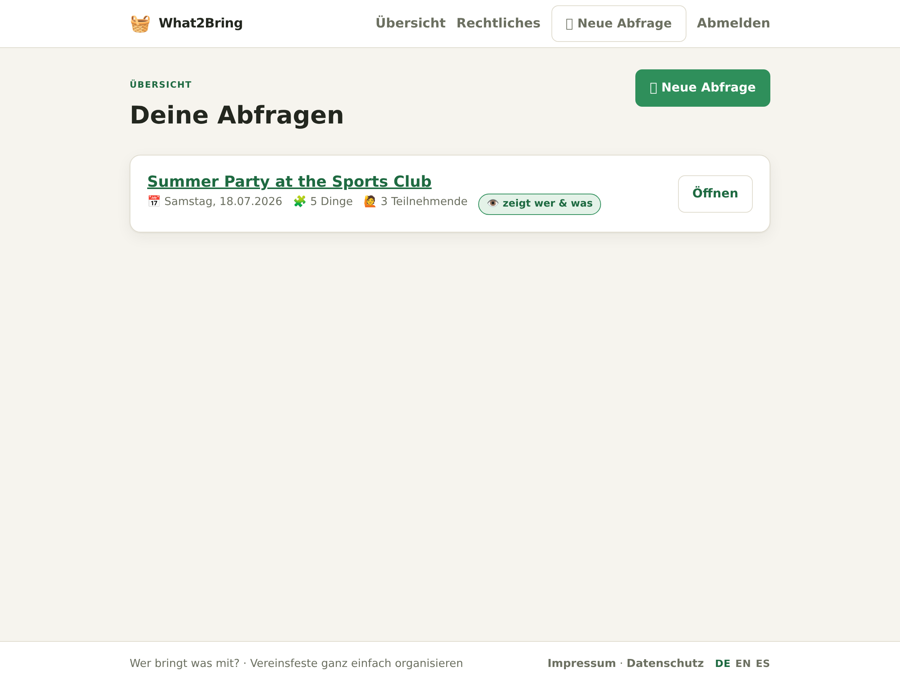 | 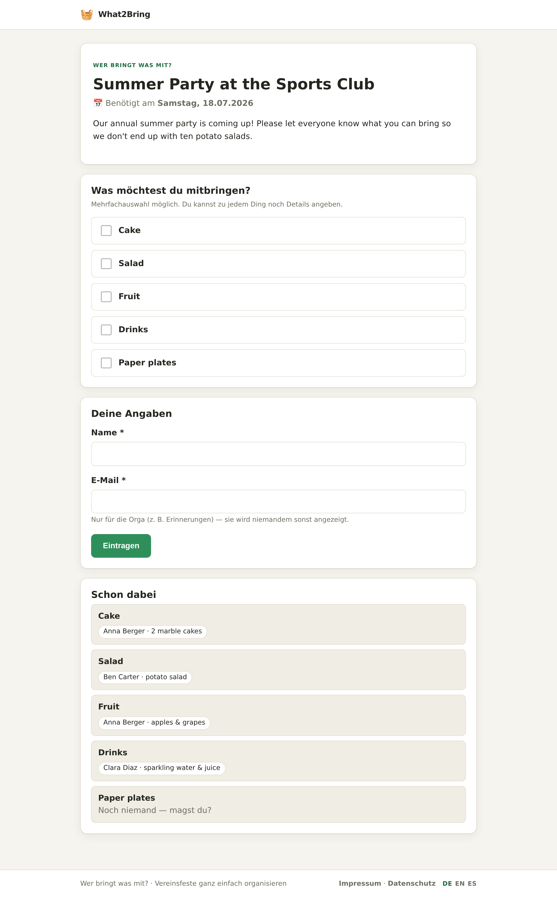 |

## Inhalt
1. [Voraussetzungen](#1-voraussetzungen)
2. [Installation](#2-installation)
3. [Erste Anmeldung](#3-erste-anmeldung)
4. [Die Übersicht](#4-die-übersicht)
5. [Abfrage anlegen](#5-abfrage-anlegen)
6. [Abfrage verwalten & Link teilen](#6-abfrage-verwalten--link-teilen)
7. [Erinnerungen versenden](#7-erinnerungen-versenden)
8. [Die Teilnahmeseite](#8-die-teilnahmeseite)
9. [Impressum & Datenschutzerklärung](#9-impressum--datenschutzerklärung)
10. [Sprachen](#10-sprachen)
11. [Sicherheit & Datenschutz](#11-sicherheit--datenschutz)
12. [Auf Shared-Hosting bereitstellen (z. B. Strato)](#12-auf-shared-hosting-bereitstellen-z-b-strato)
13. [Backup](#13-backup)
14. [Fehlerbehebung](#14-fehlerbehebung)

---

## 1. Voraussetzungen
- **PHP 8.0+** mit der Erweiterung **`pdo_sqlite`** (im Standard-PHP-Docker-Image enthalten und bei den meisten Shared-Hostern aktiviert).
- Die Möglichkeit, einen Ordner über HTTP auszuliefern. Idealerweise kannst du das Document-Root der Domain auf den Ordner **`public/`** der App zeigen lassen; falls nicht, liegt ein Fallback-`.htaccess` bei.
- **Kein** Datenbankserver, **kein** Composer, **kein** Build-Schritt. Der E-Mail-Versand nutzt einen winzigen eingebauten SMTP-Client.

## 2. Installation

1. **Code besorgen** — lade ein Release-Archiv herunter oder klone das Repository und lade es auf deinen Server hoch.
2. **Document-Root** — richte deine Domain auf das Verzeichnis **`public/`** aus. Alles Sensible (`config.php`, die
   Datenbank, `inc/`, `templates/`) liegt dann *oberhalb* des Web-Roots. Wenn du das Document-Root nicht verschieben kannst, sperrt die
   mitgelieferte `.htaccess` auf oberster Ebene stattdessen den direkten Zugriff auf diese Pfade.
3. **Öffne die Seite im Browser.** Beim allerersten Aufruf — solange `config.php` noch nicht existiert — zeigt What2Bring
   einen **Einrichtungs-Assistenten** (Installer):

   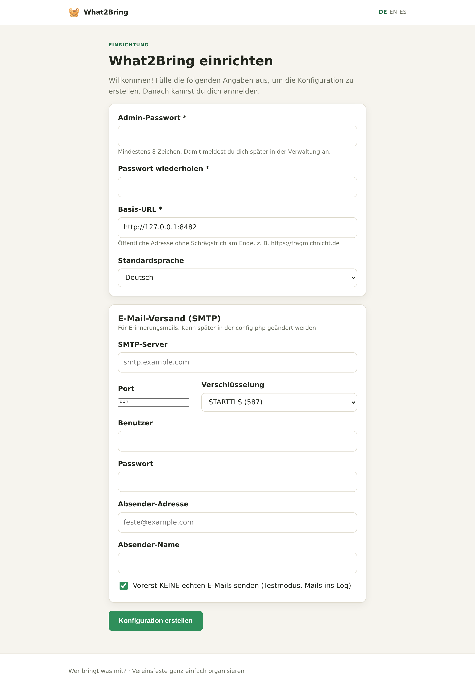

   Trage ein:
   - **Admin-Passwort** (mind. 8 Zeichen) — damit meldest du dich an.
   - **Basis-URL** — die öffentliche Adresse ohne abschließenden Schrägstrich, z. B. `https://example.com`. Dient zum Bauen der
     teilbaren Links.
   - **Standardsprache** — DE / EN / ES.
   - **SMTP** (jetzt optional, später änderbar) — Server, Port + Verschlüsselung (STARTTLS/587 oder SSL/465), Benutzer,
     Passwort, Absenderadresse und -name.
   - **„Vorerst KEINE echten E-Mails senden"** — lass den Haken gesetzt, um in einem sicheren *Trockenlauf* zu starten (Erinnerungen
     landen in einer Log-Datei, statt versendet zu werden). Nimm den Haken weg, sobald deine SMTP-Daten stimmen.

   Ein Klick auf **Konfiguration erstellen** schreibt `config.php` (mit frisch erzeugtem Passwort-Hash und geheimem
   *Pepper*) und der Installer **sperrt sich selbst** — er läuft nie wieder, solange `config.php` existiert.

> **Manuelle Alternative:** Kopiere `config.php.example` nach `config.php` (eine Ebene oberhalb von `public/`) und fülle sie von
> Hand aus. Den Passwort-Hash erzeugst du mit `php -r "echo password_hash('DEIN-PW', PASSWORD_DEFAULT);"` und den Pepper
> mit `php -r "echo bin2hex(random_bytes(32));"`.

## 3. Erste Anmeldung
Rufe `…/index.php?r=admin.login` auf und gib dein Admin-Passwort ein.

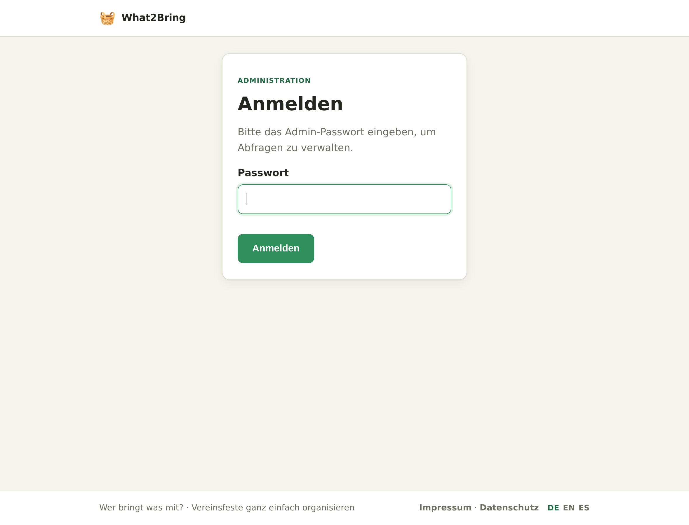

## 4. Die Übersicht
Nach der Anmeldung landest du in der **Übersicht** — der Liste aller deiner Abfragen mit Datum, Anzahl der Dinge, Anzahl der
Teilnehmenden und einem Sichtbarkeits-Abzeichen. Über **＋ Neue Abfrage** legst du eine an.

## 5. Abfrage anlegen
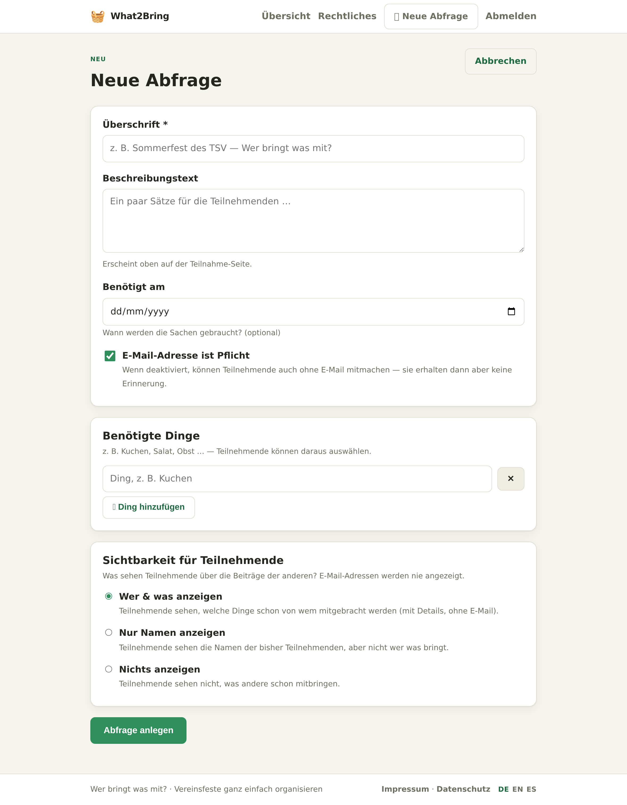

- **Überschrift** — der Titel, den die Teilnehmenden sehen (z. B. *„Sommerfest im Sportverein"*).
- **Beschreibung** — ein paar freundliche Sätze (optional).
- **Benötigt am** — das Datum, an dem die Dinge gebraucht werden (optional).
- **E-Mail-Adresse ist erforderlich** — ein Schalter je Abfrage. Ist er **aus**, können Leute *ohne* E-Mail-Adresse
  mitmachen (sie erhalten dann einfach keine Erinnerungen).
- **Benötigte Dinge** — füge so viele hinzu, wie du möchtest (Kuchen, Salat, Obst …). Die Teilnehmenden wählen daraus aus.
- **Sichtbarkeit für Teilnehmende** — was Leute über die Einträge *anderer* sehen. E-Mail-Adressen werden **nie** gezeigt:
  - **Wer & was anzeigen** — Namen + was sie mitbringen (mit Details).
  - **Nur Namen anzeigen** — nur, wer mitmacht.
  - **Nichts anzeigen** — Teilnehmende sehen die Einträge anderer nicht.

## 6. Abfrage verwalten & Link teilen
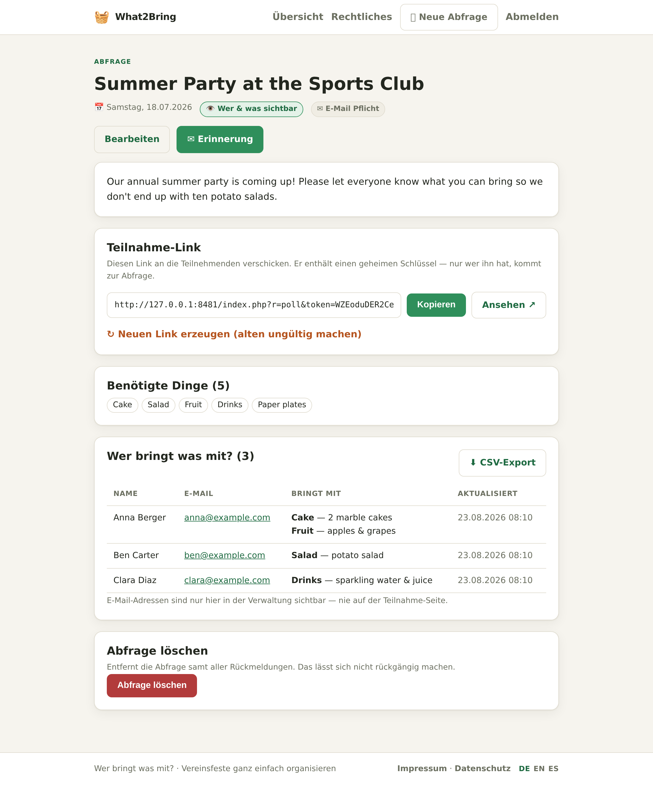

- **Teilnahme-Link** — die geheime URL zum Verschicken. Sie enthält einen zufälligen Schlüssel; nur wer den Link hat, erreicht die
  Abfrage (Suchmaschinen werden per `noindex` ausgesperrt). **Kopiere** ihn oder **öffne** ihn in einem neuen Tab.
- **Neuen Link erzeugen** — wechselt den Schlüssel. Der **alte Link funktioniert sofort nicht mehr** (praktisch, falls ein Link durchgesickert ist).
- **Benötigte Dinge** — ein schneller Überblick über die festgelegten Dinge.
- **Wer bringt was mit?** — jede Rückmeldung, **inklusive der E-Mail-Adresse** (nur für dich sichtbar, nie öffentlich).
  Einträge ohne E-Mail zeigen „— (keine E-Mail)".
- **CSV-Export** — lade alle Rückmeldungen (Name, E-Mail, bringt mit, Aktualisiert) als semikolon-getrennte UTF-8-Datei herunter, die
  sich sauber in Excel öffnet.
- **Abfrage löschen** — entfernt die Abfrage und alle ihre Rückmeldungen (unwiderruflich).

## 7. Erinnerungen versenden
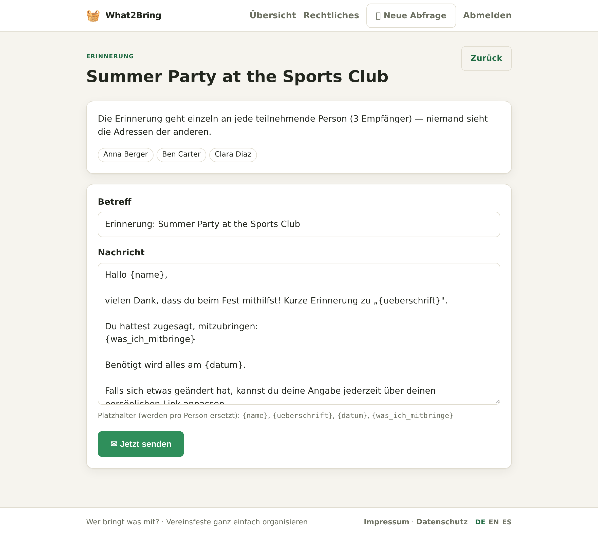

Schreibe einen Betreff und eine Nachricht und sende dann. Jede teilnehmende Person erhält eine **individuelle** E-Mail (ein Empfänger pro
Nachricht — niemand sieht die Adresse eines anderen). Diese Platzhalter werden pro Person ersetzt:

| Platzhalter | Wird zu |
|---|---|
| `{name}` | dem Namen der teilnehmenden Person |
| `{ueberschrift}` | der Überschrift der Abfrage |
| `{datum}` | dem „Benötigt am"-Datum |
| `{was_ich_mitbringe}` | dem, was diese Person mitzubringen zugesagt hat |

Kontaktiert werden nur Teilnehmende, die eine E-Mail angegeben haben. Das Nachrichtenfeld ist mit einer Vorlage in der aktuellen
Sprache vorbelegt — passe sie vor dem Senden nach Belieben an.

## 8. Die Teilnahmeseite
Das sehen Leute, wenn sie den geheimen Link öffnen. Sie haken die Dinge ab, die sie mitbringen, ergänzen optional ein Detail
pro Ding und tragen ihren Namen ein (und die E-Mail, falls erforderlich). Ein erneutes Absenden mit der **gleichen E-Mail**
aktualisiert den vorherigen Eintrag, statt ein Duplikat anzulegen.

| Desktop | Mobil |
|---|---|
|  | 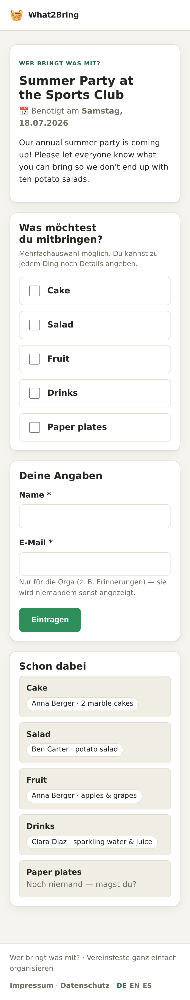 |

Je nach Sichtbarkeit der Abfrage sehen sie außerdem einen Bereich **„Wer ist dabei"** (Namen oder Namen + Dinge). Nach dem
Absenden erhalten sie eine freundliche Bestätigung:

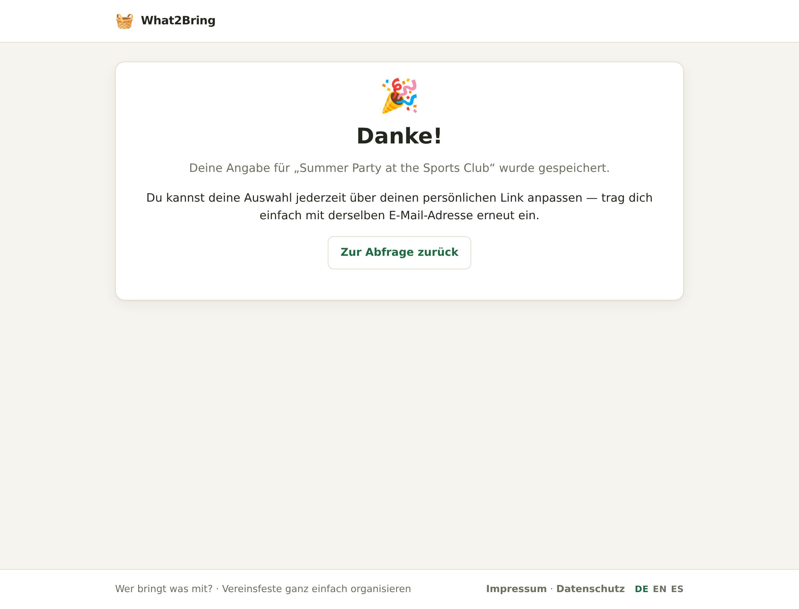

## 9. Impressum & Datenschutzerklärung
Wenn du die Seite unter deiner eigenen Domain betreibst, brauchst du in der Regel ein **Impressum** und eine **Datenschutzerklärung**. What2Bring
macht beides **im Admin-Bereich editierbar** (Menü **Rechtliches**) — ohne Code-Änderungen, gespeichert in der Datenbank. Jedes Feld ist
mit einer Vorlage vorbelegt, die `[Platzhalter in Klammern]` enthält, die du ersetzt.

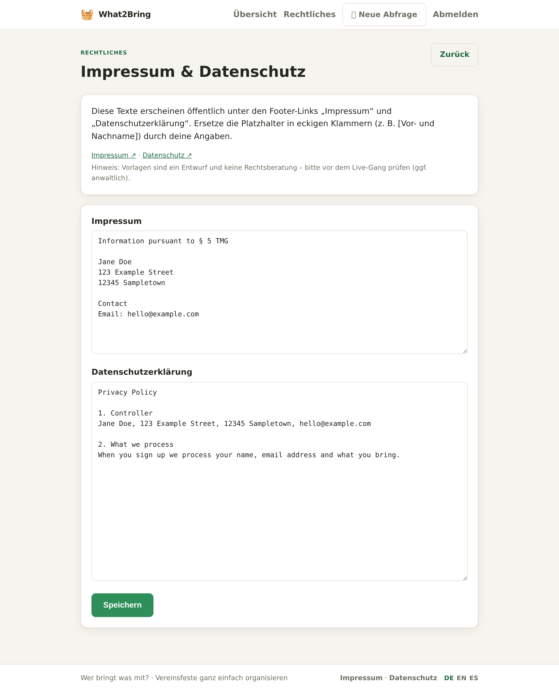

Die Texte werden öffentlich veröffentlicht und in der Fußzeile jeder Seite verlinkt:

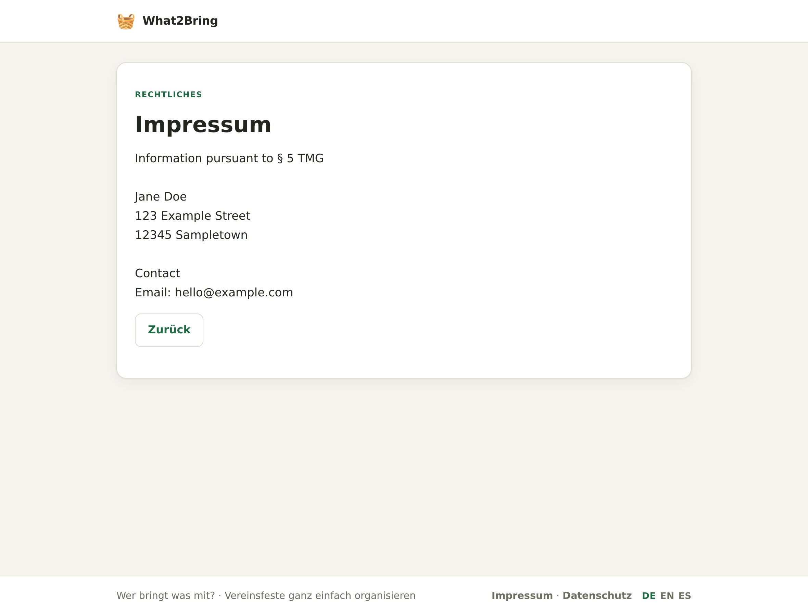

> ⚠️ Die Vorlagen sind ein **erster Entwurf, keine Rechtsberatung** — prüfe sie (und lass sie im Zweifel prüfen),
> bevor du live gehst.

## 10. Sprachen
What2Bring wird in **Deutsch, Englisch und Spanisch** ausgeliefert. Besucherinnen und Besucher schalten die Sprache über die Links
**DE · EN · ES** in der Fußzeile um; die Auswahl wird für ihre Sitzung gemerkt. Neue Besuchende bekommen die Sprache aus ihrem Browser,
ersatzweise die **Standardsprache**, die du bei der Einrichtung festgelegt hast (`default_lang` in `config.php`). Auch die Vorlagen für
Erinnerungs-E-Mails und die rechtlichen Texte sind lokalisiert.

## 11. Sicherheit & Datenschutz
- **E-Mail-Adressen gelangen nie an die Öffentlichkeit.** Klartext-Adressen liegen in einer *getrennten* Tabelle, die der öffentliche
  Code-Pfad nie liest — eine Teilnahmeseite kann die E-Mail einer Person also strukturell gar nicht anzeigen.
- **Geheime Links** nutzen Zufalls-Tokens mit ≥128 Bit, sind `noindex` und können gewechselt werden.
- **CSRF-Tokens** schützen jedes Formular (Admin *und* Teilnahme); jeder Datenbankzugriff nutzt Prepared Statements; jede
  Ausgabe wird HTML-escaped.
- **Der Admin-Login** speichert nur einen Passwort-*Hash* und drosselt wiederholte Fehlversuche.
- Erinnerungen werden **einzeln pro Empfänger** versendet (kein CC/BCC), mit gegen Injection gehärteten Mail-Headern.

## 12. Auf Shared-Hosting bereitstellen (z. B. Strato)
- Zeige das **Document-Root der Domain am besten auf `public/`**. Ist das nicht möglich, verweigert die mitgelieferte
  `.htaccess` auf oberster Ebene den Web-Zugriff auf `inc/`, `data/`, `templates/`, `config.php` und `schema.sql`.
- `config.php` und das Verzeichnis `data/` müssen **oberhalb** des Document-Roots liegen (oder per `.htaccess` gesperrt sein).
- Das Routing ist **query-basiert** (`index.php?r=…`), daher ist `mod_rewrite` **nicht** erforderlich.
- Mache `data/` für den Webserver **beschreibbar** — die SQLite-Datenbank wird beim ersten Zugriff automatisch angelegt.
- Trage die SMTP-Daten ein und nimm den Haken beim Trockenlauf weg (oder setze `mail_dry_run` auf `false`), sobald du zum echten Versand bereit bist.

## 13. Backup
Es gibt kein eingebautes Backup. Deine Daten sind eine einzige SQLite-Datei in `data/` (z. B. `what2bring.sqlite`) — kopiere sie zum
Sichern, spiele sie zurück, um zurückzurollen. Auf Shared-Hosting nimm sie in das Backup deines Hosters auf oder exportiere die Rückmeldungen per CSV.

## 14. Fehlerbehebung
| Symptom | Wahrscheinliche Ursache / Abhilfe |
|---|---|
| Browser zeigt unerwartet den **Einrichtungs-Assistenten** | `config.php` fehlt oder liegt nicht eine Ebene oberhalb von `public/`. |
| Teilnahme-Link zeigt **„Nicht gefunden"** | Falsches oder gewechseltes Token — *Neuen Link erzeugen* macht alte Links ungültig. |
| **Erinnerungen kommen nicht an** | Prüfe `mail_dry_run` (Trockenlauf schreibt nach `data/mail.log`); prüfe SMTP-Host/-Port/-Verschlüsselung und dass der Absender zum authentifizierten Postfach passt. |
| Fehler **„Konfiguration fehlt"** | `config.php` nicht gefunden — starte den Installer oder erstelle sie aus `config.php.example`. |
| Wochentag/Datum in falscher Sprache | Die Sprache folgt dem Umschalter in der Fußzeile / `default_lang`. |

---

*What2Bring — Vereinsfeste ganz einfach organisieren.*
